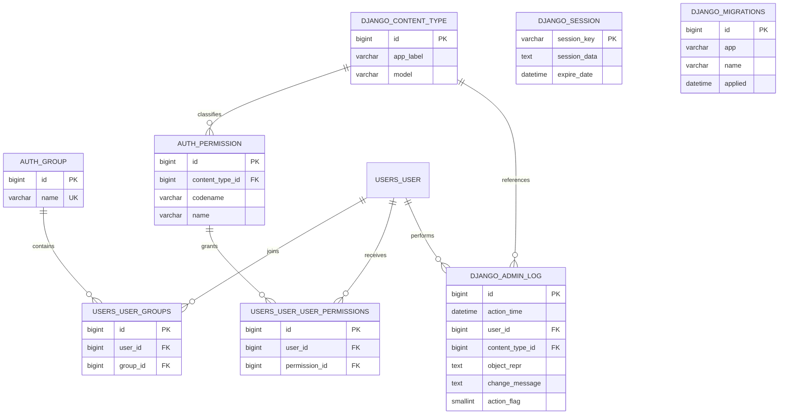

# Data Diet ER Diagram

This diagram reflects the current database structure in the Django backend after adding saved AI plans.

## Application Tables

```mermaid
erDiagram
    USERS_USER {
        bigint id PK
        varchar username UK
        varchar password
        varchar first_name
        varchar last_name
        varchar email
        varchar role
        boolean is_staff
        boolean is_active
        boolean is_superuser
        datetime last_login
        datetime date_joined
    }

    USERS_DOCTORPROFILE {
        bigint id PK
        bigint user_id FK UK
        varchar specialty
        text bio
        boolean is_verified
    }

    USERS_DOCTORAPPLICATION {
        bigint id PK
        bigint user_id FK UK
        varchar full_name
        int age
        varchar specialty
        varchar phone_number
        varchar contact_email
        varchar certificate_file
        varchar status
        datetime reviewed_at
        datetime created_at
        datetime updated_at
    }

    AI_PLANS_SAVEDNUTRITIONPLAN {
        bigint id PK
        bigint user_id FK
        varchar goal
        varchar focus
        text note
        json profile_snapshot
        json plan_content
        varchar status
        datetime created_at
        datetime updated_at
    }

    USERS_USER ||--o| USERS_DOCTORPROFILE : has
    USERS_USER ||--o| USERS_DOCTORAPPLICATION : submits
    USERS_USER ||--o{ AI_PLANS_SAVEDNUTRITIONPLAN : owns
```

## Django System Tables



## Table Purposes

- `users_user`: جدول المستخدمين الرئيسي، وهو مبني على `AbstractUser` مع حقل `role`.
- `users_doctorprofile`: ملف مهني اختياري للطبيب بعد التحقق أو الإعداد.
- `users_doctorapplication`: طلب انضمام الطبيب مع الشهادة وحالة المراجعة.
- `ai_plans_savednutritionplan`: الخطط الغذائية التي يولدها العميل ويتم حفظها للرجوع لها لاحقًا.
- `auth_group`: مجموعات الصلاحيات في Django.
- `auth_permission`: صلاحيات Django المرتبطة بالموديلات والعمليات.
- `django_content_type`: مرجع لأنواع الموديلات المستخدمة داخليًا من Django.
- `users_user_groups`: جدول وسيط يربط المستخدمين بالمجموعات.
- `users_user_user_permissions`: جدول وسيط يربط المستخدمين بالصلاحيات المباشرة.
- `django_admin_log`: سجل العمليات المنفذة من لوحة الإدارة.
- `django_session`: جلسات Django إذا استُخدمت.
- `django_migrations`: سجل المايجريشن المطبقة على قاعدة البيانات.

## Relationship Summary

- كل `User` يمكن أن يملك `DoctorProfile` واحد كحد أقصى.
- كل `User` يمكن أن يملك `DoctorApplication` واحد كحد أقصى.
- كل `User` يمكن أن يملك عدة `SavedNutritionPlan`.
- كل `Permission` ترتبط بـ `ContentType` واحد.
- المستخدم يمكن أن ينتمي لعدة `Group` عبر جدول وسيط.
- المستخدم يمكن أن يملك عدة `Permission` مباشرة عبر جدول وسيط.

## Notes

- قاعدة البيانات الحالية هي `PostgreSQL` بحسب [backend/core/settings.py](C:\Data-Diet\backend\core\settings.py).
- جدول `ai_plans_savednutritionplan` أُضيف بعد ميزة حفظ الخطط، لذلك يجب تنفيذ `migrate` لظهوره فعليًا في قاعدة البيانات.
- لم أدرج جداول الحزم الخارجية التي لا تُنشئ موديلات مستقلة هنا، مثل `rest_framework` و `simplejwt`، لأن هذا المشروع يستخدم JWT بدون جداول إضافية خاصة بها في البنية الحالية.
