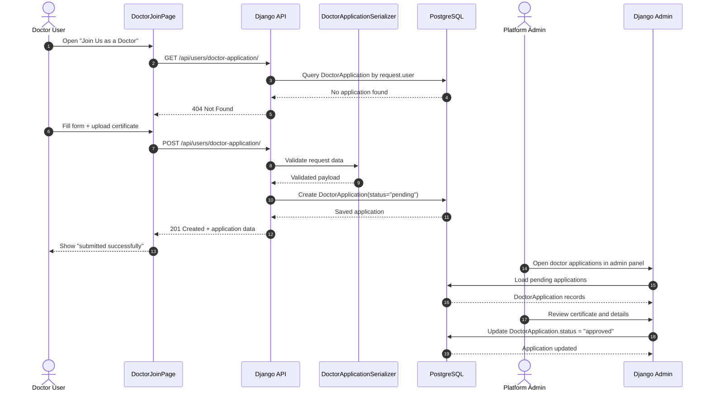
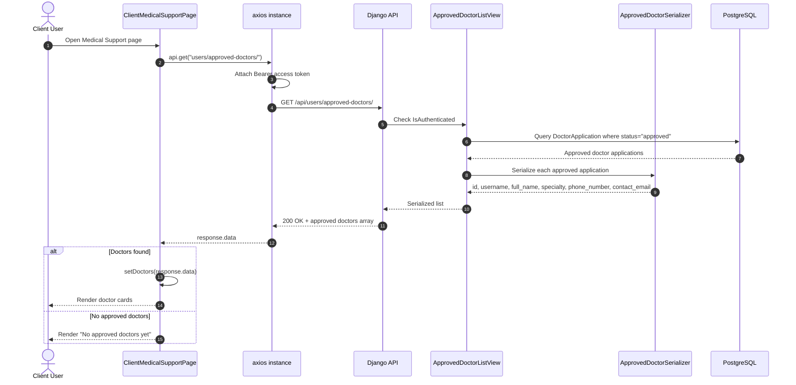
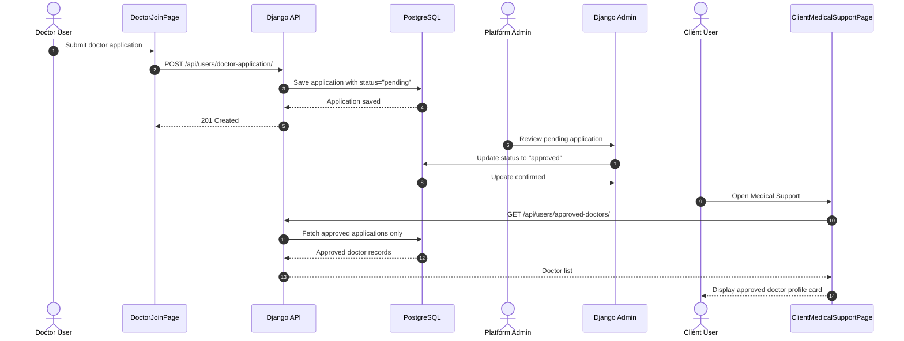

# Data Diet Sequence Diagrams

These sequence diagrams are based on the current implementation in the repository.

## 1) Doctor Application Approval Flow

Note: the project currently has no dedicated approval API endpoint. Approval appears to happen through Django Admin by updating `DoctorApplication.status` from `pending` to `approved`.

## 2) Showing Approved Doctor Profile In Client Interface

Note: in the current frontend, approved doctors are displayed in `ClientMedicalSupportPage`. The data source is `DoctorApplication` records filtered by `status='approved'`.

## 3) End-To-End Combined View

## Implementation References

- [views.py](/C:/Data-Diet/backend/users/views.py)
- [serializers.py](/C:/Data-Diet/backend/users/serializers.py)
- [admin.py](/C:/Data-Diet/backend/users/admin.py)
- [DoctorJoinPage.jsx](/C:/Data-Diet/frontend/src/pages/doctor/DoctorJoinPage.jsx)
- [ClientMedicalSupportPage.jsx](/C:/Data-Diet/frontend/src/pages/client/ClientMedicalSupportPage.jsx)
